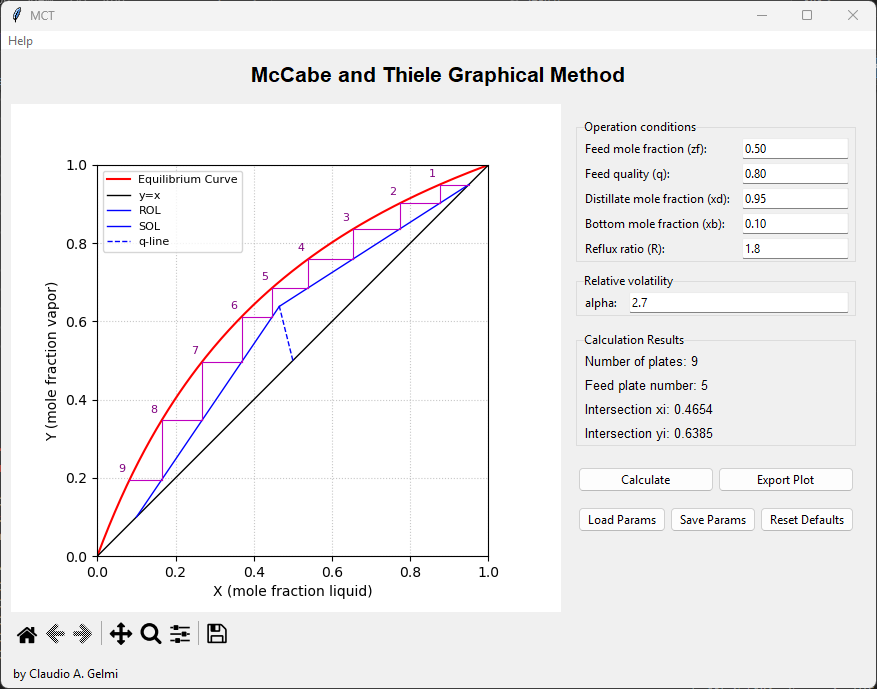
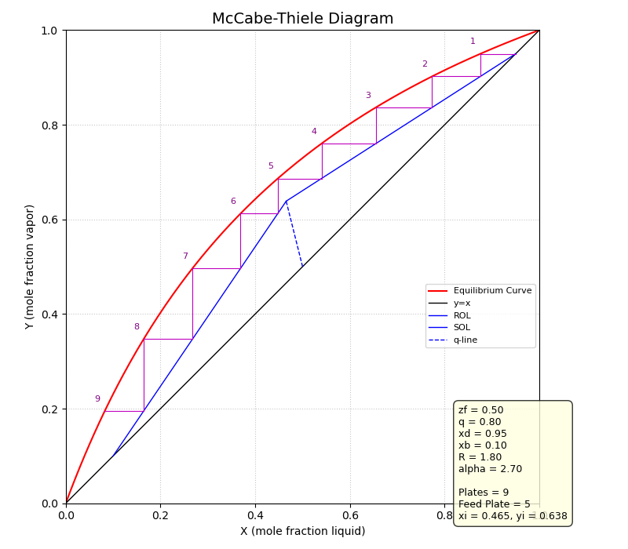
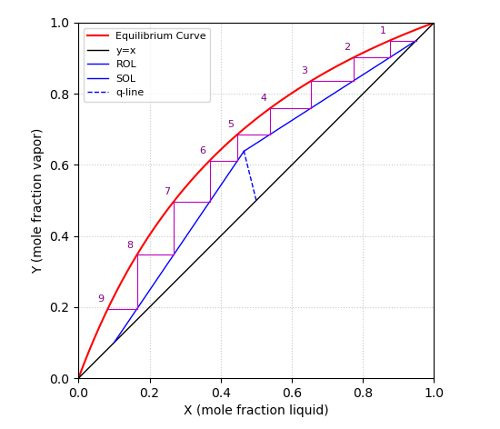

# McCabe-Thiele Graphical Method GUI

This Python application provides a Graphical User Interface (GUI) for performing McCabe-Thiele graphical method calculations to estimate the number of theoretical plates required for a binary distillation column.

The development of this Python GUI was developed with the assitance of Google's Gemini 2.5 Pro Preview model, which helped in translating the logic from a MATLAB version created by me.

## Table of Contents

* [Features](#features)
* [Screenshots](#screenshots)
* [How to Run](#how-to-run)
  * [Requirements](#requirements)
  * [Installation](#installation)
  * [Running the Application](#running-the-application)
* [Functionality Explained](#functionality-explained)
  * [Input Parameters](#input-parameters)
  * [Calculations](#calculations)
  * [Plotting](#plotting)
  * [Interactive Features](#interactive-features)
* [Contributing](#contributing)
* [License](#license)

## Features

* **Graphical McCabe-Thiele Diagram:** Visualizes the equilibrium curve, operating lines (ROL, SOL), q-line, and stepped-off theoretical plates.
* **User Input:** Allows users to specify:

  * Feed mole fraction (zf)
  * Feed quality (q)
  * Distillate mole fraction (xd)
  * Bottoms mole fraction (xb)
  * Reflux ratio (R)
  * Relative volatility (alpha)
* **Results Display:** Shows the calculated:

  * Number of theoretical plates
  * Optimal feed plate number
  * Intersection point of operating lines (xi, yi)
* **Interactive Plot:**

  * Hover over plot elements (equilibrium curve, stages, intersection point) to see detailed coordinate information.
  * Standard Matplotlib navigation toolbar for zoom, pan, and saving the plot.
* **Parameter Management:**

  * Save current input parameters to a JSON file.
  * Load input parameters from a JSON file.
  * Reset parameters to default values.
* **Export Plot:** Save the generated McCabe-Thiele diagram as an image file (PNG, JPG, PDF) with annotated input parameters.
* **Error Handling:** Provides feedback for invalid inputs or non-feasible distillation conditions.

## Screenshots

### Main GUI (Default Values)



### Exported Plot (Default Values)



### Save with Matplotlib Toolbar (Default Values)



## How to Run

### Requirements

Make sure you have Python 3 installed. You will also need the following Python libraries:

* **Tkinter:** Usually comes standard with Python installations.
* **Matplotlib:** For plotting.
* **NumPy:** For numerical calculations.

### Installation

1.  **Ensure Python 3 is installed.** You can download it from [python.org](https://www.python.org/).
2.  **Clone or download this repository.**
3.  **(Recommended) Create and activate a virtual environment:**
    *   Using standard Python `venv`:
        ```bash
        python -m venv venv
        source venv/bin/activate  # On Linux/macOS
        venv\Scripts\activate.bat   # On Windows CMD
        venv\Scripts\Activate.ps1 # On Windows PowerShell
        ```
    *   Using Conda:
        ```bash
        conda create --name mccabe_env python=3.10 # Or your preferred version
        conda activate mccabe_env
        ```
4.  **Install the required libraries:** Navigate to the project directory in your terminal (with the virtual environment activated) and run:
    ```bash
    pip install -r requirements.txt
    ```

### Running the Application

1. Clone this repository or download the `mccabe_thiele_gui.py` file.
2. Navigate to the directory containing the script in your terminal.
3. Run the script using Python:

   ```bash
   python mccabe_thiele_gui.py
   ```

## Functionality Explained

### Input Parameters

The user provides the following operating conditions for the binary distillation:

* **Feed mole fraction (zf):** Mole fraction of the more volatile component in the feed.
* **Feed quality (q):** Defines the thermal condition of the feed.

  * `q = 0`: Saturated vapor feed
  * `q = 1`: Saturated liquid feed
  * `0 < q < 1`: Two-phase feed (mixture of liquid and vapor)
  * `q > 1`: Subcooled liquid feed
  * `q < 0`: Superheated vapor feed
* **Distillate mole fraction (xd):** Desired mole fraction of the more volatile component in the distillate (top product).
* **Bottoms mole fraction (xb):** Desired mole fraction of the more volatile component in the bottoms (bottom product).
* **Reflux ratio (R):** Ratio of the liquid returned to the column (reflux) to the liquid removed as distillate. $R = L/D$.
* **Relative volatility (alpha):** A measure of the separability of the two components. Assumed constant for this model.

### Calculations

Upon clicking the "Calculate" button:

1. **Inputs are validated:** Checks for numerical validity and logical constraints (e.g., `0 < zf < 1`, `xb < zf < xd`, `alpha > 1`).

2. **Equilibrium Curve:** Calculated using the formula:

   ```
   y = alpha * x / (1 + (alpha - 1) * x)
   ```

3. **q-line:** The slope of the q-line is determined by the feed quality `q`. Its equation is:

   ```
   y = (q / (q - 1)) * x - (zf / (q - 1))
   ```

   (or `x = zf` if `q = 1`).

4. **Rectifying Operating Line (ROL):**

   ```
   y = (R / (R + 1)) * x + (xd / (R + 1))
   ```

5. **Intersection Point (xi, yi):** The point where the q-line, ROL, and Stripping Operating Line (SOL) intersect is calculated. This point is crucial for determining the feed plate.

6. **Stripping Operating Line (SOL):** This line passes through `(xb, xb)` and `(xi, yi)`.

7. **Distillation Feasibility:** The program checks if the calculated `yi` at the intersection `xi` is below the equilibrium curve. If `yi` is above the equilibrium value at `xi`, distillation under the given conditions (especially `R`) is not possible.

8. **Stepping Off Stages:** Starting from `(xd, xd)`, theoretical stages are stepped off by drawing alternating horizontal lines to the equilibrium curve and vertical lines to the appropriate operating line (ROL above `xi`, SOL below `xi`). The number of steps required to reach or pass `xb` is the number of theoretical plates.

9. **Feed Plate Location:** The plate where the stepping transitions from the ROL to the SOL (i.e., the first stage whose x-coordinate on the equilibrium curve is less than or equal to `xi`) is identified as the optimal feed plate.

### Plotting

The GUI displays:

* **Equilibrium curve:** (red).
* **y=x line:** (45-degree diagonal, black).
* **q-line:** (blue, dashed).
* **Rectifying Operating Line (ROL):** (blue).
* **Stripping Operating Line (SOL):** (blue).
* **Stepped-off theoretical plates:** (magenta), with each stage numbered.

### Interactive Features

* **Hover Tooltips:** Moving the mouse cursor over the plot will display information about the point under the cursor, such as coordinates on the equilibrium curve or stage information.
* **Parameter Management:**

  * **Save Params:** Saves the current values in all input fields to a user-specified JSON file.
  * **Load Params:** Loads values from a previously saved JSON file into the input fields. The user then needs to press "Calculate" to see the plot update.
  * **Reset Defaults:** Restores all input fields to their initial default values and recalculates the plot.
* **Export Plot:**

  * Allows the user to save the current diagram as an image (PNG, JPG, PDF).
  * The saved image includes a text box annotating the input parameters, calculated number of plates, feed plate, and the `(xi, yi)` intersection point.
* **Matplotlib Toolbar:** Standard Matplotlib controls are available below the plot for zooming, panning, and saving the figure manually.

## Contributing

Contributions, bug reports, and feature requests are welcome! Please feel free to open an issue or submit a pull request.
When contributing to this repository, please first discuss the change you wish to make via issue or email with the maintainers before making a change.

## License

This project is licensed under the MIT License.
